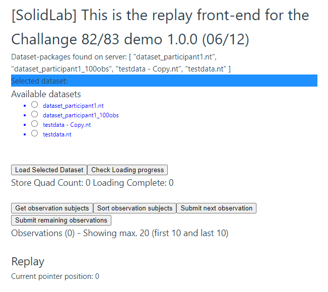
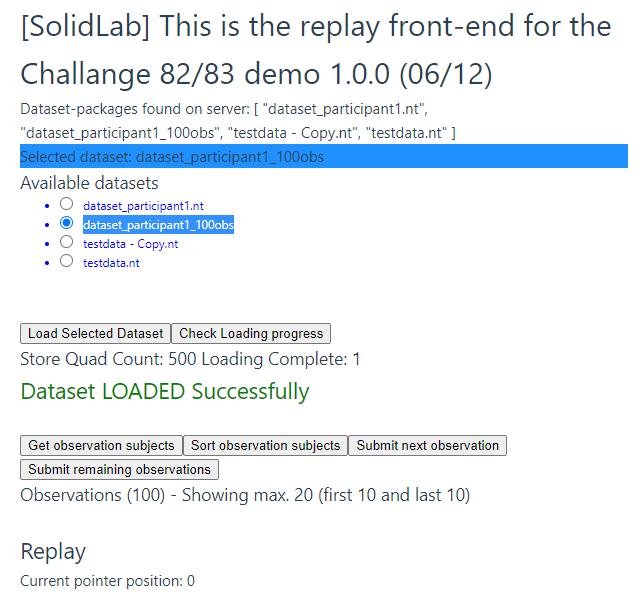

# LDES in Solid Semantic Observations Replay

## Name
LDES in Solid Semantic Observations Replay

## Description
Data streams are becoming omnipresent and are a crucial component in many use cases. 
Storing streams in a low-cost file-based web environment could be done using Linked Data Event Streams (LDES). 
However, pushing large volumes of high volatile data into a Solid-based LDES is still not possible due to 
the way current solution do the partitioning of the data, i.e. 
after all data has been retrieved, instead of in a streaming fashion. 
The former crashes the Solid server due to the high load on the server when repartitioning large amounts of data.
Data from the DAHCC dataset will be used for purpose, 
which contains data streams describing the behaviour of various patients. 
The streams contain over 100.000 events.

As many applications are using data streams, 
a way to easily replay captured streams is necessary for demoing purposes, scalability testing or data recovery. 
Replaying allows to mimic the real-time behaviour of data streams, even though the data is historical data. 
A replayer is a crucial component to showcase how our solutions can process live data streams and 
how they can handle different data rates.
The DAHCC dataset will be used as example to replay the data.

## Installation
### Engine: 

1. Run an LDES-enabled CSS, capable of processing LDES metadata via
   ```shell
   docker run --rm -p 3000:3000 -it solidproject/community-server:latest -c config/default.json
   ```
2. Navigate to the folder `engine` via
   ```shell
   cd engine
   ```
3. Edit the properties file `src/config/replay_properties.json`. 
   You find information about this file below.
   You find sample datasets at https://dahcc.idlab.ugent.be/dataset.html.
4. Install the required dependencies via 
   ```shell
   npm i
   ```
5. Start the engine with the command in the engine root folder via 
   ```shell
   npm start
   ```

The output should look similar to the following:

```shell
> challenge-16---replay---backend---typescript@1.0.0 start

> tsc && node dist/app.js`

{port: [Getter], loglevel: [Getter], logname: [Getter], datasetFolders: [Getter], credentialsFileName: [Getter], lilURL: [Getter], treePath: [Getter], chunkSize: [Getter], bucketSize: [Getter], targetResourceSize: [Getter], default: {port: '3001', loglevel: 'info', logname: 'WEB API', datasetFolders: C:\\nextcloud\\development\\challenge16-replay\\main\\Challenge 16 - Replay - Backend - Typescript\\data', credentialsFileName: null, lilURL: 'http://localhost:3000/test/', treePath: 'https://saref.etsi.org/core/hasTimestamp', chunkSize: 10, bucketSize: 10, targetResourceSize: 1024}}

2022-12-08T14:58:54.612Z [WEB API] info: Express is listening at http://localhost:3001
```
REMARK: Should you receive following error message

```shell
`src/algorithms/Naive.ts:66:51 - error TS2345: Argument of type 'import("C:/temp/CLEAN3/ldes-in-solid-semantic-observations-replay/engine/node_modules/@inrupt/solid-client-authn-node/dist/Session").Session' is not assignable to parameter of type 'import("C:/temp/CLEAN3/ldes-in-solid-semantic-observations-replay/engine/node_modules/@treecg/versionawareldesinldp/node_modules/@inrupt/solid-client-authn-node/dist/Session").Session'.
 Types have separate declarations of a private property 'clientAuthentication'.

66     const comm = session ? new SolidCommunication(session) : new LDPCommunication();
```

Please delete the folder `node_modules\@treecg\versionawareldesinldp\node_modules\@inrupt`. 
This is due to conflicting dependencies and 
should be resolved once the `versionawareldesinldp` package has been refactored.

### Properties file
Below you find more information properties used in the `replay_properties.json` file:

1. "port": "3001" ==> The port on which the engine should be running,
2. "loglevel": "info" ==> Configuration of the amount of logging,
3. "logname": "WEB API" ==> Name of the logger,
4. "datasetFolders": "" ==> Server-side path where the data is stored that can be potentially replayed, e.g. `/home/data/`,
5. "credentialsFileName": null ==> Authentication as per Solid CSS Specification,
6. "lilURL": "http://localhost:3000/test/" ==> URI of the LDES to be created,
7. "treePath": "https://saref.etsi.org/core/hasTimestamp" ==> The (ordered) property according wo which the observations are to be streamed into the LDES,
8. "chunkSize": 10 ==> For visualisation purposes, defines how many of the Observations are to be displayed when requested by the webapp (support parameter),
9. "bucketSize": 10 ==> How many observations should be contained in a single bucket of the LDES,
10. "targetResourceSize": 1024 ==> Target size of the resources on disk, this is a rough estimate and belongs to the Solid Event Sourcing implementation (https://github.com/woutslabbinck/SolidEventSourcing).


#### testing / API description:
1. Get all loadable datasets using a GET request via
   ```shell
   curl http://localhost:3001/datasets
   ```
   You get something like
   ```shell
   ["dataset_participant1_100obs","dataset_participant2_100obs"]
   ```
2. Load a particular dataset using a GET request via
   ```shell
   curl http://localhost:3001/loadDataset?dataset=dataset_participant1_100obs ==> 
   ```
   You get an empty result.
3. Check the loading progress (in quad count) using a GET request via
   ```shell
   curl http://localhost:3001/checkLoadingSize
   ```
   You get something like
   ```shell
   [500]
   ```
4. Get the actual observation count (quads / observation) using a GET request via
   ```shell
   curl http://localhost:3001/checkObservationCount
   ```
   You get something like
   ```shell
   [100]
   ```
5. Sort the loaded observations (as according to the configured TreePath) using a GET request via
   ```shell
   curl http://localhost:3001/sortObservations
   ```
   You get something like
   ```shell
   [["https://dahcc.idlab.ugent.be/Protego/_participant1/obs0","https://dahcc.idlab.ugent.be/Protego/_participant1/obs1","https://dahcc.idlab.ugent.be/Protego/_participant1/obs2" ... ]]
   ```
6. Get a sample (as in the configured chunk) set of observations using a GET request via
   ```shell
   curl http://localhost:3001/getObservations
   ```
   You get something like
   ```shell
   [{"termType":"NamedNode","value":"https://dahcc.idlab.ugent.be/Protego/_participant1/obs0"},{"termType":"NamedNode","value":"https://dahcc.idlab.ugent.be/Protego/_participant1/obs1"} ...}]
   ```
7. Replay one next observation using a GET request via
   ```shell
   curl http://localhost:3001/advanceAndPushObservationPointer
   ```
   You get something like
   ```shell
   [1]
   ```
   This represents the pointer to the next replayable observation. 
   Checking the LDES in the Solid Pod (default: http://localhost:3000/test/), 
   you should see at least two containers (the inbox and the LDES buckets), 
   where the LDES buckets should now contain the replayed observation, 
   e.g. http://localhost:3000/test/1641197095000/aa28a2fa-010f-4b81-8f3c-a57f45e13758.

### Web app: 

1. Install the required dependencies via 
   ```shell
   npm i
   ```
2. Start the Web app in Vue.js with the command in the Web app root folder via
   ```shell
   npm run dev
   ```
   The output should look similar to the following:
   
   ```shell
   > challenge-16---replay@0.0.0 dev
   
   > vite
   
     VITE v3.0.9  ready in 6083 ms
   
    ➜  Local:   http://127.0.0.1:5173/
   
    ➜  Network: use --host to expose
   ```
3. The Web app can then be accessed using your browser by navigating to the aforementioned URL. 
   This should guide you to the front-end, similar to the picture below:

   

4. Select the required dataset to be replayed into an LDES in Solid pod, 
   e.g. `dataset_participant1_100obs` which holds 100 observations from the DAHCC dataset generated by Patricipant1.
5. Click `Load Selected Dataset`.
6. Wait for the dataset to be loaded into the engine. 
   The Web page should change into something like in the picture below:

   

7. Sort the observation per timestamp by clicking on the `Sort observation subjects` button. 
   A status indicator for the progress of the sorting is not yet provided.
8. In case desired, a sample of the loaded subjects can be retrieved by clicking on the `Get observation results` button. 
   You should get something similar to:

   

9. Now you can submit the first observation to be replayed into the LDES in Solid pod, 
   by clicking on the `Submit next observation` button. 
   You should see the `Current pointer position` variable at the bottom of the screen increase by one. 
   This indicates that the observation was submitted, and 
   that the pointer in the by timestamp sorted replay dataset is moved forward.

10. This can be repeated, resulting in more observation being submitted and resulting in the pointer ever moving forward.

11. Alternatively, the remainder of the dataset can be replayed in one go from the current pointer onwards 
    until the end of the dataset, by clicking on `Submit remaining observations`.

12. Mind that replay progress can always be checked directly in the CSS as well, 
    e.g. by surfing to `http://localhost:3000/test/`

## Usage
A streaming Solid-based LDES connector that can partition the data in a streaming fashion, 
i.e. when retrieving the data instead of needing to wait till the whole dataset is received.

The replayer should be able to read a number of files, and 
stream out the events described in each file. 
To facility performance and scalability testing, 
the rates and number of streams should be configurable.

## Screencast
You find a screen below.

https://user-images.githubusercontent.com/19285142/230097455-26d40ebd-6852-4372-9057-81698d74e93e.mp4

## Support
Stijn.Verstichel@UGent.be

## Roadmap
A connector is required that investigates the LDES, computes the need for a new bucket and adds the events of the stream either to a new bucket or to an existing one based on the timestamps of these events. In more detail the following functionality is required:
- [x] functionality to connect to and RDF stream, either pull or push based,
- [x] investigation of the current LDES, i.e. do new buckets need to be created,
- [x] if new buckets are required, the LDES itself needs to be updated,
- [x] new events are added to the right bucket, and
- [x] the bucket size should be parameterized.

The replayer should be a library that allows to:

- [x] read multiple files or directory,
- [x] stepwise replay,
- [x] bulk replay until the end of the dataset,
- [ ] stream out the result, possible using multiple output streams (configurable),
- [ ] configure the replay frequency, i.e. how fast the events should be streamed out,
- [ ] configure burst in the replay frequency, i.e. a certain times the event rate rises drastically to mimic high load/usage periods,
- [ ] assign new timestamps to the replayed events(the property should be configurable),
- [ ] configure the event shape (to know which triples belong to each event), and
- [ ] optionally first map raw data, e.g. CSV, to RDF


